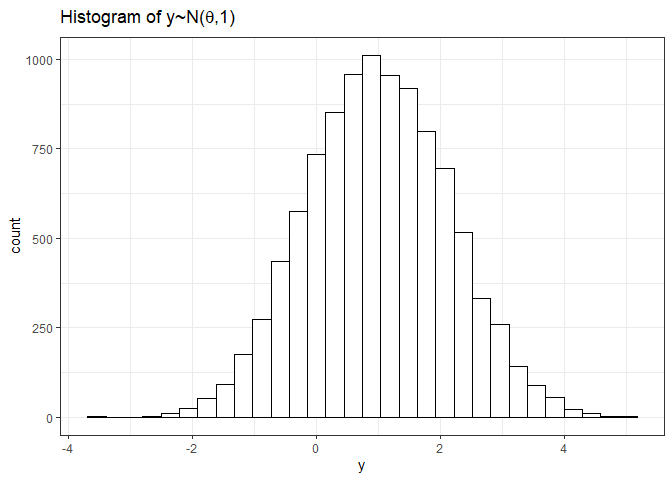
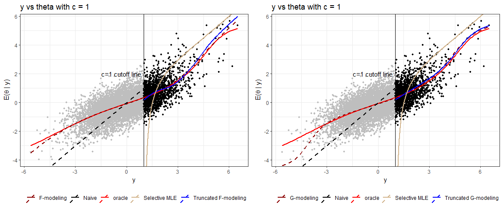
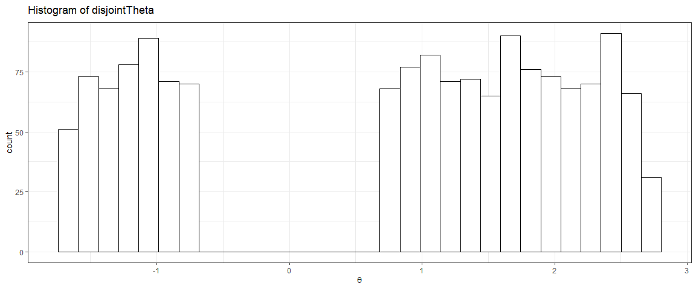
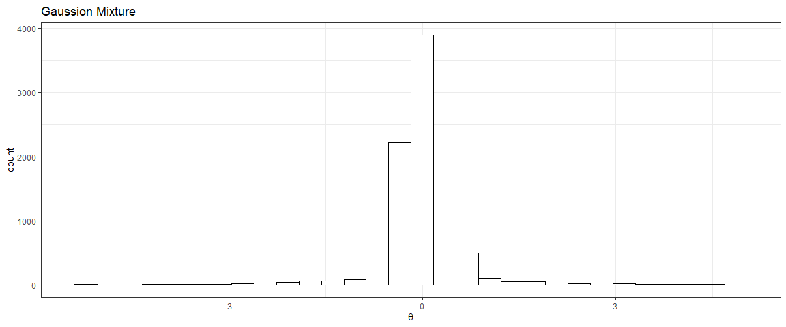
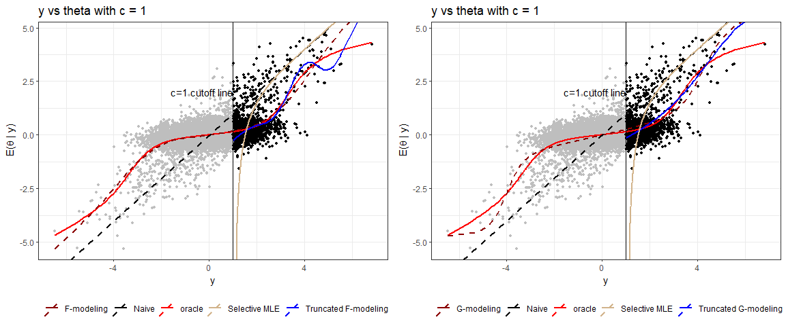
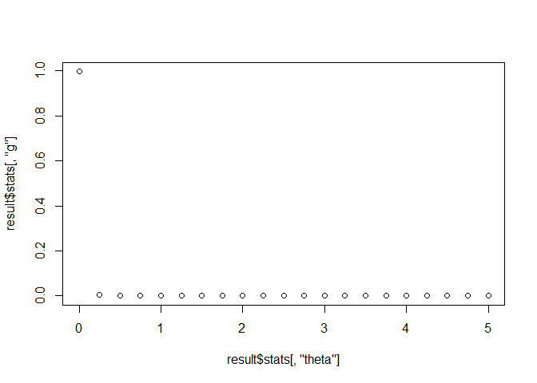
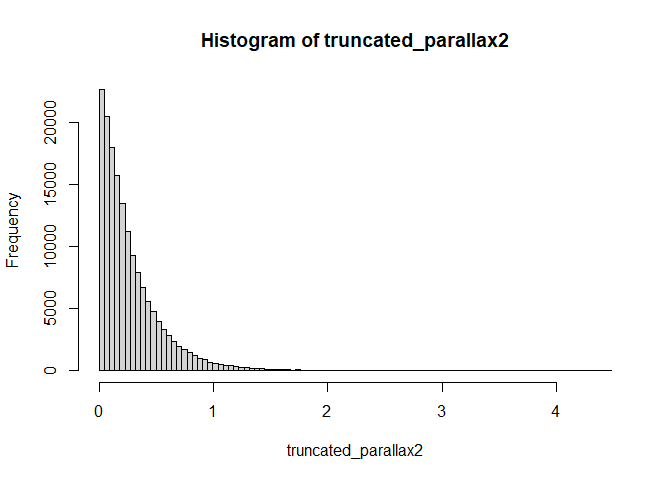

``` r
# function to use in the simulation

deconvo_trunc <- function(a,b,tau,X,pDegree,n=40,c0=1,fam="Normal") {
  if( any(X<a | X>b) ) stop('x not between a and b')
  .result <- deconv(tau = tau, X = X, family = fam, pDegree = pDegree,n=n,c0 =c0) 
  Q <- .result$Q
  h.f <- hist(X,breaks = seq(range(X)[1],range(X)[2],length.out = n),plot = FALSE)
  y <- h.f$counts
  P <- .result$P
  P <- t(t(P)/colSums(P))
  result <- deconv(tau = tau, P = P, Q = Q, y = y, pDegree = pDegree,c0=1,family = "Normal")
  return(result)
}

deconvo_trunc_comp <- function(a,b,tau,X,pDegree,n=40,c0=1) {
  if( any(X<a | X>b) ) stop('x not between a and b')
  .result <- deconv(tau = tau, X = X, family = "Normal", pDegree = pDegree,n=n,c0 =c0) 
  Q <- .result$Q
  h.f <- hist(X,breaks = seq(range(X)[1],range(X)[2],length.out = n),plot = FALSE)
  y <- h.f$counts
  P <- .result$P
  return(P)
}
# a function that implement Lindsey_method
lindseys_method <- function(y,bins=30,deg=5){
  to_model <- hist(y,breaks = bins,plot = F)
  y_to_model <- to_model$counts
  X_to_model <- to_model$mids
  f <- glm(y_to_model ~ ns(X_to_model,df = deg), family=poisson)$fit
  lz <- as.vector(log(f))
 
  lz.=diff(lz)/diff(X_to_model)
  new_centers <- (X_to_model[-1]+X_to_model[-length(X_to_model)])/2
  bays_corret<-approx(new_centers,lz.,y,rule=2,ties=mean)$y
return(bays_corret)
}
# a function that create an input P matrix
create_P_matrix <- function(nr=2,nc=2,x=c(0,1),theta=c(1,2),sig=c(1,2),eps=0.001,dist="Normal",bin_n=100) {
  P<- matrix(data = NA,nrow = nr,ncol = nc)
  for (i in 1:nr) {
    for (j in 1:nc) {
      P[i,j] <- pnorm(q=x[i]+eps,mean=theta[j],sd=sig[j])-pnorm(q=x[i]-eps,mean=theta[j],sd=sig[j])
    }
  }
  return(P)
}
```

``` r
theta <- runif(10000,0,2)# theta is uniform
y <- rnorm(10000,theta,1) # y is normal distribution with mu=theta
ggplot(data =data.frame(y) ) +geom_histogram(aes(y),bins = 30,col="black",fill="white") + ggtitle(TeX("Histogram of y~N(\\theta,1)")) +theme_bw()
```



``` r
library('locfdr')
data(hivdata)
alp <- 1.64
oracle_bayes <- function(theta,y){ # estimation of theta
  res<-sum(theta*dnorm(y,theta,sd=1)/sum(dnorm(y,theta,sd=1)))
  return(res)
}
```

``` r
# 
MSE_simulation<-function(mu,alp,plt1=F,plt2=F,plt3=F,tau_range,ct,rank=6){

  # calculate oracle bayes
y <- rnorm(length(mu),mu,1)
E_theta_oracle <- c()
for (i in 1:length(y)) {
  E_theta_oracle <- c(E_theta_oracle,oracle_bayes(mu,y[i]))
  }


# create selection and range of tau
data <- data.frame(theta=mu, y=y)
data$selected <- data$y>alp
sub_data <- subset(data,data$selected==TRUE)
tau <-seq(from = tau_range[1], to = tau_range[2], by = 0.01)

# calculate G
res <- deconv(tau = tau,X = data$y ,family = "Normal",pDegree = rank,n=100,c0 =2)
g <- res$stats[,"g"]


result <- deconvo_trunc(a=alp,b=Inf,tau,X=c(sub_data$y),pDegree=rank,n=100,c0=2)
P_t <-deconvo_trunc_comp(a=alp,b=Inf,tau,X=c(sub_data$y),pDegree=rank,n=100,c0=2)
tprobs.hat <- result$stats[,'g']
ct1 <-colSums(P_t)>ct


# calculate selective MLE
theta_selective <- seq(-5,alp+20,length.out = 1000)
selcetive_mle <- theta_selective +dnorm(alp-theta_selective)/(1-pnorm(alp-theta_selective))
theta_selective <- c(-100,theta_selective)
selcetive_mle <- c(alp,selcetive_mle)

E_theta_selective <- approx(selcetive_mle,theta_selective,xout =sub_data$y)$y

# calculate G_s
f <- function(tau,y,tprobs.hat,ct){sum(tau[ct] * tprobs.hat[ct] * dnorm(y,tau[ct])/(1-pnorm(alp-tau[ct])),na.rm = TRUE)/sum(tprobs.hat[ct] * dnorm(y,tau[ct])/(1-pnorm(alp-tau[ct])),na.rm = TRUE)
}


# calculate G
f_full<-function(tau,y,g){sum(tau * g * dnorm(y,tau),na.rm = TRUE)/sum(g*dnorm(y,tau),na.rm = TRUE)}

# calculate Gs conditional expectation
E_theta_trunc <- c()
  for (i in 1:length(sub_data$y)) {
  E_theta_trunc <- c(E_theta_trunc,f(tau,sub_data$y[i],tprobs.hat=tprobs.hat,ct=ct1))}
if (plt1==T) {
  plot(sub_data$y,E_theta_trunc,main = "Truncated Bayes   estimator",ylab="E(theta|x_i)",xlab="x_i")
}  


# calculate g conditional expectation
E_theta_g <-c()
for (i in 1:length(data$y)) {
E_theta_g<-c(E_theta_g,f_full(tau,data$y[i],g=g))}  


if (plt1==T) {
  plot(sub_data$y,E_theta_trunc_fixed,main = "Truncated Bayes estimator",ylab="E(theta|x_i)",xlab="x_i")
}


lz <-lindseys_method(y=sub_data$y,deg = rank)
lz1 <-lindseys_method(y=data$y,deg = rank)
# calculate F_s conditional expectation
E_theta_trunc_F <- sub_data$y+lz
E_theta_F <- data$y+lz1
df_total <- data.frame(cbind(sub_data$y,E_theta_trunc,E_theta_selective,E_theta_g[which(data$selected==T)],E_theta_trunc_F,E_theta_oracle[which(data$selected==T)],E_theta_F[which(data$selected==T)],sub_data$theta))


colnames(df_total)<-c("selected_y","E_theta_trunc","E_theta_selective","E_theta_g","E_theta_trunc_F","E_theta_oracle",'E_theta_F',"theta_selected")


Gs_plot<-ggplot(data, aes(x = y)) +  geom_point(aes(y = mu),col = ifelse(y < alp, "grey", "black"), size = 1) + geom_line(data = data.frame(y = y, E_theta_oracle = E_theta_oracle), 
aes(x = sort(y), y = sort(E_theta_oracle),color = "oracle"),linetype="solid",linewidth = 1) +geom_line(data = data.frame(y = y, E_theta_g = E_theta_g), 
aes(x = sort(y), y = sort(E_theta_g),color = "G-modeling"),linetype="dashed", linewidth = 1) +geom_line(data=df_total,aes(x = selected_y,y=E_theta_trunc,color = "Truncated G-modeling"), linewidth = 1) +geom_abline(aes(intercept = 0, slope = 1,color = "Naive"), linetype = "dashed",linewidth = 1) +
geom_line(data=df_total,aes(x = selected_y,y = E_theta_selective,color = "Selective MLE"), linewidth = 1)+coord_cartesian(ylim=c(min(data$theta),max(data$theta))) +
geom_vline(xintercept = alp) +
annotate("text", x = alp - 1.3, y = 2, label = paste0("c=", alp, " cutoff line")) +
labs(x = "y", y = TeX("E(\\theta | y)")) +
ggtitle(paste("y vs theta with c =", alp)) +
scale_color_manual(values = c("oracle" = "red", "G-modeling" = "darkred", "Truncated G-modeling" = "blue","Selective MLE" = "tan", "Naive" = "black"))+
scale_size_continuous(range = c(2, 2)) + theme_bw() +theme(legend.position = "bottom", legend.title = element_blank()) 

Fs_plot <-ggplot(data, aes(x = y)) +  geom_point(aes(y = mu),col = ifelse(y < alp, "grey", "black"), size = 1) + geom_line(data = data.frame(y = y, E_theta_oracle = E_theta_oracle), 
aes(x = sort(y), y = sort(E_theta_oracle),color = "oracle"),linetype="solid",linewidth = 1) +geom_line(data = data.frame(y = y, E_theta_g = E_theta_g), 
aes(x = sort(y), y = sort(E_theta_F),color = "F-modeling"),linetype="dashed", linewidth = 1) +geom_line(data=df_total,aes(x = selected_y,y=E_theta_trunc_F,color = "Truncated F-modeling"), linewidth = 1) +geom_abline(aes(intercept = 0, slope = 1,color = "Naive"), linetype = "dashed",linewidth = 1) +
geom_line(data=df_total,aes(x = selected_y,y = E_theta_selective,color = "Selective MLE"), linewidth = 1)+coord_cartesian(ylim = c(min(data$theta),max(data$theta))) +
geom_vline(xintercept = alp) +
annotate("text", x = alp - 1.3, y = 2, label = paste0("c=", alp, " cutoff line")) +
labs(x = "y", y = TeX("E(\\theta | y)")) +
ggtitle(paste("y vs theta with c =", alp)) +
scale_color_manual(values = c("oracle" = "red", "F-modeling" = "darkred", "Truncated F-modeling" = "blue","Selective MLE" = "tan", "Naive" = "black"))+
scale_size_continuous(range = c(2, 2))+theme_bw()+theme(legend.position = "bottom", legend.title = element_blank()) 

if (plt2==T) {
print(ggarrange(Fs_plot,Gs_plot,nrow = 1))
}
if (plt3==T){
  print(Fs_plot)
  print(Gs_plot)
}


return(df_total)
}
```

``` r
hiv <- hivdata
ggplot(data =data.frame(hiv)) +geom_histogram(aes(hiv),bins = 30,col="black",fill="white") + ggtitle(TeX("Histogram of HIV microarray")) +theme_bw() +xlab(TeX("\\theta"))
```


``` r
df_total<-MSE_simulation(mu=hiv,tau_range =  c(-5,6),alp=1,plt2=T,ct=0.005,rank = 5)
```



``` r
MSE_df <- data.frame()
findf <- data.frame()
findf_sd <-data.frame()
alp_range <-seq(0,3,1)
for (j in alp_range) {
  for (i in 1:1) {
  dfs<-MSE_simulation(mu=hiv,tau_range = c(-5,6),alp=j,ct=0.005,rank = 5)
  MSE_s <-c(mean((dfs$E_theta_trunc-dfs$theta_selected)^2),mean((dfs$E_theta_selective[dfs$E_theta_selective>-4]-dfs$theta_selected[dfs$E_theta_selective>-4])^2),mean((dfs$E_theta_g-dfs$theta_selected)^2),mean((dfs$E_theta_trunc_F-dfs$theta_selected)^2),mean((dfs$E_theta_oracle-dfs$theta_selected)^2),mean((dfs$E_theta_F-dfs$theta_selected)^2),mean((dfs$selected_y-dfs$theta_selected)^2))
  MSE_df<-rbind(MSE_df,MSE_s)
  }
  findf<-rbind(findf,colMeans(MSE_df))
  findf_sd <-rbind(findf_sd,apply(MSE_df,2,sd))
  MSE_df <- data.frame()
}

colnames(findf)<-c("E_theta_trunc_G","E_theta-selective","E_theta_G","E_theta_trunc_F","E_theta_oracle","E_theta_F","Naive")
rownames(findf)<-c("0","1","2","3")
print(findf)
```

    ##   E_theta_trunc_G E_theta-selective E_theta_G E_theta_trunc_F E_theta_oracle
    ## 0       0.4960102          2.156671 0.4897821       0.5014519      0.4902111
    ## 1       0.5771766          2.791615 0.5629122       0.5664229      0.5551395
    ## 2       0.7915634          3.779202 0.7799920       0.8133371      0.7838380
    ## 3       1.2094434          3.170558 0.9672980       1.1902460      0.9534126
    ##   E_theta_F    Naive
    ## 0 0.4916418 1.044543
    ## 1 0.5616557 1.772004
    ## 2 0.7810601 2.495287
    ## 3 0.9738404 3.368642

``` r
colnames(findf_sd)<-c("E_theta_trunc_G","E_theta-selective","E_theta_G","E_theta_trunc_F","E_theta_oracle","E_theta_F","Naive")
rownames(findf_sd)<-c("0","1","2","3")
print(findf_sd)
```

    ##   E_theta_trunc_G E_theta-selective E_theta_G E_theta_trunc_F E_theta_oracle
    ## 0              NA                NA        NA              NA             NA
    ## 1              NA                NA        NA              NA             NA
    ## 2              NA                NA        NA              NA             NA
    ## 3              NA                NA        NA              NA             NA
    ##   E_theta_F Naive
    ## 0        NA    NA
    ## 1        NA    NA
    ## 2        NA    NA
    ## 3        NA    NA

``` r
t<-disjointTheta
ggplot(data =data.frame(t)) +geom_histogram(aes(t),bins = 30,col="black",fill="white") + ggtitle(TeX("Histogram of disjointTheta")) +theme_bw()+xlab(TeX("\\theta"))
```



``` r
df_total<-MSE_simulation(mu=t,tau_range =  c(-2,3),alp=1,plt2=T,ct=0.1,rank=3)
```


``` r
MSE_df <- data.frame()
findf <- data.frame()
findf_sd <-data.frame()
alp_range <-seq(0,3,1)
for (j in alp_range) {
  for (i in 1:1) {
  dfs<-MSE_simulation(mu=t,tau_range = c(-2,3),alp=j,ct=0.1,rank=3)
  MSE_s <-c(mean((dfs$E_theta_trunc-dfs$theta_selected)^2),mean((dfs$E_theta_selective[dfs$E_theta_selective>-2]-dfs$theta_selected[dfs$E_theta_selective>-2])^2),mean((dfs$E_theta_g-dfs$theta_selected)^2),mean((dfs$E_theta_trunc_F-dfs$theta_selected)^2),mean((dfs$E_theta_oracle-dfs$theta_selected)^2),mean((dfs$E_theta_F-dfs$theta_selected)^2),mean((dfs$selected_y-dfs$theta_selected)^2))
  MSE_df<-rbind(MSE_df,MSE_s)
  }
 findf<-rbind(findf,colMeans(MSE_df))
  findf_sd <-rbind(findf_sd,apply(MSE_df,2,sd))
  MSE_df <- data.frame()
}

colnames(findf)<-c("E_theta_trunc_G","E_theta-selective","E_theta_G","E_theta_trunc_F","E_theta_oracle","E_theta_F","Naive")
rownames(findf)<-c("0","1","2","3")
print(findf)
```

    ##   E_theta_trunc_G E_theta-selective E_theta_G E_theta_trunc_F E_theta_oracle
    ## 0       0.5905448          1.458860 0.6008775       0.6162354      0.5866387
    ## 1       0.3665895          1.814759 0.3746594       0.3681194      0.3575685
    ## 2       0.3241309          2.350874 0.2618516       0.2640296      0.2358635
    ## 3       0.2857852          2.402939 0.2656583       0.7016156      0.2180702
    ##   E_theta_F     Naive
    ## 0 0.6330822 0.9922279
    ## 1 0.4439667 0.8581252
    ## 2 0.4528155 1.2216412
    ## 3 0.3225595 2.4563073

``` r
colnames(findf_sd)<-c("E_theta_trunc_G","E_theta-selective","E_theta_G","E_theta_trunc_F","E_theta_oracle","E_theta_F","Naive")
rownames(findf_sd)<-c("0","1","2","3")
print(findf_sd)
```

    ##   E_theta_trunc_G E_theta-selective E_theta_G E_theta_trunc_F E_theta_oracle
    ## 0              NA                NA        NA              NA             NA
    ## 1              NA                NA        NA              NA             NA
    ## 2              NA                NA        NA              NA             NA
    ## 3              NA                NA        NA              NA             NA
    ##   E_theta_F Naive
    ## 0        NA    NA
    ## 1        NA    NA
    ## 2        NA    NA
    ## 3        NA    NA

``` r
t <- c()
for (i in 1:10000) {
  u <- runif(1)
  if (u>0.90) {
    t<-c(t,rnorm(1,mean=0,sd=sqrt(3)))
  }else{t<-c(t,rnorm(1,mean = 0,sd=sqrt(0.1)))}
}


ggplot(data =data.frame(t)) +geom_histogram(aes(t),bins = 30,col="black",fill="white") + ggtitle(TeX("Gaussion Mixture")) +theme_bw() +xlab(TeX("\\theta"))
```



``` r
df_total<-MSE_simulation(mu=t,tau_range =  c(-5,7),alp=1,plt2=T,ct=0.005,rank=5)
```



``` r
MSE_df <- data.frame()
findf <- data.frame()
findf_sd <-data.frame()
alp_range <-seq(0,3,1)
for (j in alp_range) {
  for (i in 1:1) {
  dfs<-MSE_simulation(mu=t,tau_range = c(-5,7),alp=j,ct=0.005,rank=5)
  MSE_s <-c(mean((dfs$E_theta_trunc-dfs$theta_selected)^2),mean((dfs$E_theta_selective[dfs$E_theta_selective>-1.5]-dfs$theta_selected[dfs$E_theta_selective>-1.5])^2),mean((dfs$E_theta_g-dfs$theta_selected)^2),mean((dfs$E_theta_trunc_F-dfs$theta_selected)^2),mean((dfs$E_theta_oracle-dfs$theta_selected)^2),mean((dfs$E_theta_F-dfs$theta_selected)^2),mean((dfs$selected_y-dfs$theta_selected)^2))
  MSE_df<-rbind(MSE_df,MSE_s)
  }
 findf<-rbind(findf,colMeans(MSE_df))
  findf_sd <-rbind(findf_sd,apply(MSE_df,2,sd))
  MSE_df <- data.frame()
}

colnames(findf)<-c("E_theta_trunc_G","E_theta-selective","E_theta_G","E_theta_trunc_F","E_theta_oracle","E_theta_F","Naive")
rownames(findf)<-c("0","1","2","3")
print(findf)
```

    ##   E_theta_trunc_G E_theta-selective E_theta_G E_theta_trunc_F E_theta_oracle
    ## 0       0.2714995          1.185697 0.2394174       0.2690057      0.2302358
    ## 1       0.4323545          1.510105 0.4518068       0.4335915      0.4180130
    ## 2       1.0056360          1.961897 0.9407176       0.9583075      0.8869789
    ## 3       1.4543338          2.567098 1.3426534       1.2812342      1.2027942
    ##   E_theta_F     Naive
    ## 0 0.2313843 0.9493847
    ## 1 0.4208551 2.0753223
    ## 2 0.9004840 3.5573775
    ## 3 1.2076576 3.1635908

``` r
colnames(findf_sd)<-c("E_theta_trunc_G","E_theta-selective","E_theta_G","E_theta_trunc_F","E_theta_oracle","E_theta_F","Naive")
rownames(findf_sd)<-c("0","1","2","3")
print(findf_sd)
```

    ##   E_theta_trunc_G E_theta-selective E_theta_G E_theta_trunc_F E_theta_oracle
    ## 0              NA                NA        NA              NA             NA
    ## 1              NA                NA        NA              NA             NA
    ## 2              NA                NA        NA              NA             NA
    ## 3              NA                NA        NA              NA             NA
    ##   E_theta_F Naive
    ## 0        NA    NA
    ## 1        NA    NA
    ## 2        NA    NA
    ## 3        NA    NA

``` r
gdat_samp<- read.csv("GDR3_QUASARS_1.csv")


gdat_samp$norm_parallax <- gdat_samp$parallax/gdat_samp$parallax_error
parallax <-gdat_samp$norm_parallax
ggplot(data =data.frame(parallax),aes(x=parallax)) +geom_histogram(aes(y=..density..),bins = 100,col="black",fill="white") + ggtitle(TeX("Histogram of observed parallax values")) +theme_bw()+xlab(TeX("\\omega")) + geom_density(aes(color = "Parallax Density")) + scale_colour_manual("Legend title", values = c("red", "blue"))+ stat_function(aes(colour = " Standard Normal distribution"),fun=dnorm,args=list(mean=0,sd=1),size=1)+theme(legend.position = "bottom", legend.title = element_blank())
```

    ## Warning: Using `size` aesthetic for lines was deprecated in ggplot2 3.4.0.
    ## ℹ Please use `linewidth` instead.

    ## Warning: The dot-dot notation (`..density..`) was deprecated in ggplot2 3.4.0.
    ## ℹ Please use `after_stat(density)` instead.


``` r
# calculate truncated G-modeling
truncated_parallax <-parallax[(parallax>0)]
sub_samp  <- gdat_samp[gdat_samp$parallax>0,]
row.names(sub_samp) <- NULL
truncated_parallax2 <- sub_samp$parallax
truncated_sig <- sub_samp$parallax_error

# set parameters and tau range
true_parallax <-seq(0,5,0.25)
alpa=0
ct=0.0005
P_t <-deconvo_trunc_comp(a=alpa,b=Inf,tau=true_parallax,X=truncated_parallax,pDegree=4,n=100,c0=1)
```

    ## Warning in stats::nlm(f = loglik, p = aStart, gradtol = 0.0000000001, ...):
    ## NA/Inf replaced by maximum positive value

``` r
result <- deconvo_trunc(a=alpa,b=Inf,tau=true_parallax,X=truncated_parallax,pDegree=4,n=100,c0=1)
```

    ## Warning in stats::nlm(f = loglik, p = aStart, gradtol = 0.0000000001, ...):
    ## NA/Inf replaced by maximum positive value

    ## Warning in stats::nlm(f = loglik, p = aStart, gradtol = 0.0000000001, ...):
    ## NA/Inf replaced by maximum positive value

``` r
tprobs.hat <- result$stats[,'g']
ct1 <-colSums(P_t)>ct
plot(result$stats[,'theta'],result$stats[,'g'])
```



``` r
f <- function(tau,y,tprobs.hat,sd1=1,sd2=1,ct){sum(tau[ct]/sd1 * tprobs.hat[ct] * dnorm(x=y,mean=tau[ct],sd = sd2)/(1-pnorm(q=alpa,mean =tau[ct] ,sd = sd2)),na.rm = TRUE)/sum(tprobs.hat[ct] * dnorm(x=y,mean=tau[ct],sd = sd2)/(1-pnorm(q=alpa,mean =tau[ct],sd = sd2)),na.rm = TRUE)}


# calculate Estimated parallax with LZ correction
LZ_corr<-function(w_t,w,sd_w=1,sd_w2=1){
  res<-sum((w_t/sd_w2)*(exp(-(((w_t-w)^2)/(2*(sd_w))))*((w/w_t)^4))/sum((exp(-(((w_t-w)^2)/(2*(sd_w))))*(w/w_t)^4)))
  return(res)
}

# calculate the custom P matrix with known sigma
h.f <- hist(truncated_parallax2,breaks=seq(range(truncated_parallax2)[1],range(truncated_parallax2)[2],length.out = 100))
```



``` r
sig_mids<-approx(truncated_parallax2,truncated_sig,xout=h.f$mids,rule=2,ties=mean)$y
y <- h.f$counts

custom_P_mat <- create_P_matrix(nr =length(h.f$mids),nc=length(true_parallax),x=h.f$mids,theta=true_parallax,sig = sig_mids)

custom_P_mat <- t(t(custom_P_mat)/colSums(custom_P_mat))
costom_results <- deconv(P=custom_P_mat,Q=result$Q,tau=true_parallax,y=y,pDegree=4,n=100,c0=1)
```

    ## Warning in stats::nlm(f = loglik, p = aStart, gradtol = 0.0000000001, ...):
    ## NA/Inf replaced by maximum positive value

``` r
tprobs.hat_costum <- costom_results$stats[,'g']
ct1_costum <-colSums(custom_P_mat)>ct

E_theta_trunc2 <- c()
  for (i in 1:length(truncated_parallax2)) {
  E_theta_trunc2 <- c(E_theta_trunc2,f(tau=true_parallax,y=truncated_parallax2[i],tprobs.hat=tprobs.hat_costum,ct=ct1_costum,sd2=truncated_sig[i]))}


# calculate Gs conditional expectation
E_theta_trunc <- c()
  for (i in 1:length(truncated_parallax)) {
  E_theta_trunc <- c(E_theta_trunc,f(tau=true_parallax,y=truncated_parallax[i],tprobs.hat=tprobs.hat_costum,ct=ct1,sd1=truncated_sig[i]))}


EP <-c()
for (i in 1:length(truncated_parallax)) {
  EP <-c(EP,LZ_corr(w_t=true_parallax[true_parallax>0],w=truncated_parallax[i],sd_w=1,sd_w2=truncated_sig[i]))
  
}

res <- deconv(tau = true_parallax,X = parallax,family = "Normal",pDegree = 4,n=100,c0 =1)
```

    ## Warning in stats::nlm(f = loglik, p = aStart, gradtol = 0.0000000001, ...):
    ## NA/Inf replaced by maximum positive value

``` r
g <- res$stats[,"g"]


para_data <- data.frame(truncated_parallax,EP,E_theta_trunc,E_theta_trunc2,truncated_parallax2)
colnames(para_data)<-c("parallax","LZ_corr","Truncated_G_modeling","Truncated_G_modeling_costum","tp2")

Gs_plot<-ggplot(para_data, aes(x = y)) +geom_line(data=para_data,aes(x = parallax,y=Truncated_G_modeling*truncated_sig,color = "Truncated G-modeling"), linewidth = 1)+
geom_line(data=para_data,aes(x = parallax ,y = EP*truncated_sig,color = "Lutz-Kelker correction"), linewidth = 1)+geom_abline(aes(intercept = 1, slope = 1,color = "Y=X line"), linetype = "dashed",linewidth = 1)+ coord_cartesian(ylim=c(0,max(parallax)),xlim = c(0,max(parallax))) + labs(x = "y", y = TeX("E(\\bar{\\omega_t} | \\omega)")) + ggtitle("Lutz-Kelker correction vs Truncated G-modeling") +
scale_color_manual(values = c("Truncated G-modeling" = "blue", "Lutz-Kelker correction" = "black","Y=X line"="green"))+
scale_size_continuous(range = c(2, 2)) + theme_bw() +theme(legend.position = "bottom", legend.title = element_blank()) 
Gs_plot
```


