```r
library('splines')
library('deconvolveR')
library('locfdr')
library("stringr")
library("truncnorm")
library("ggplot2")
library("extraDistr")
library("latex2exp")
library("ggpubr")
library("truncnorm")
library("ggplotify")
```

```
## Warning: package 'ggplotify' was built under R version 4.2.3
```
###  section 0: basic plots and recreating published examples 


First make a function for estimation using truncated data


```r
# a function for estimation using truncated data
deconvo_trunc <- function(a,b,tau,X,pDegree,n=40,c0=1,fam="Normal") {
  if( any(X<a | X>b) ) stop('x not between a and b')
  .result <- deconv(tau = tau, X = X, family = fam, pDegree = pDegree,n=n,c0 =c0) 
  Q <- .result$Q
  h.f <- hist(X,breaks = seq(range(X)[1],range(X)[2],length.out = n),plot = FALSE)
  y <- h.f$counts
  P <- .result$P
  P <- t(t(P)/colSums(P))
  result <- deconv(tau = tau, P = P, Q = Q, y = y, pDegree = pDegree,c0=1,family = "Normal")
  return(result)
}
# a function that output the P matrix in the estimation using truncated data
deconvo_trunc_comp <- function(a,b,tau,X,pDegree,n=40,c0=1) {
  if( any(X<a | X>b) ) stop('x not between a and b')
  .result <- deconv(tau = tau, X = X, family = "Normal", pDegree = pDegree,n=n,c0 =c0) 
  Q <- .result$Q
  h.f <- hist(X,breaks = seq(range(X)[1],range(X)[2],length.out = n),plot = FALSE)
  y <- h.f$counts
  P <- .result$P
  return(P)
}
# a function that calculate a function with lindseys method
lindseys_method <- function(y,bins,deg){
  to_model <- hist(y,breaks = bins,plot = F)
  y_to_model <- to_model$counts
  X_to_model <- to_model$mids
  f <- glm(y_to_model ~ ns(X_to_model,df = deg), family=poisson)$fit
  lz <- as.vector(log(f))
 
  lz.=diff(lz)/diff(X_to_model)
  new_centers <- (X_to_model[-1]+X_to_model[-length(X_to_model)])/2
  bays_corret<-approx(new_centers,lz.,y,rule=2,ties=mean)$y
return(bays_corret)}
```


```r
set.seed(23)
theta <- runif(10000,0,2)# theta is uniform
y <- rnorm(10000,theta,1) # y is normal distribution with mu=theta
ggplot(data =data.frame(y) ) +geom_histogram(aes(y),bins = 30,col="black",fill="white") + ggtitle(paste("Histogram of y~"),expression(N(theta,1))) +theme_bw()
```

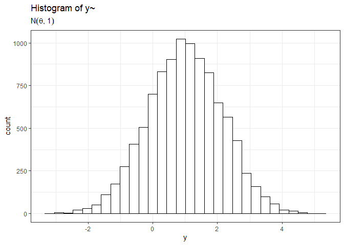<!-- -->


```r
# function that create Bayes estimators
bayes_est_parameter <- function(theta,y){ # estimation of theta
  res<-sum(theta*dnorm(y,theta,sd=1)/sum(dnorm(y,theta,sd=1)))
  return(res)
}
# create seq of x_i to estimate there posterior 
x_est1 <- seq(min(y)-2,max(y)+2,length.out=10000)
E_theta1 <- c()
for (i in 1:length(x_est1)) {
  E_theta1 <- c(E_theta1,bayes_est_parameter(theta,x_est1[i]))
}
plot(x_est1,E_theta1,ylab ="E(theta|x_i)",xlab="x_i",main="Ture bayes estimator")
```

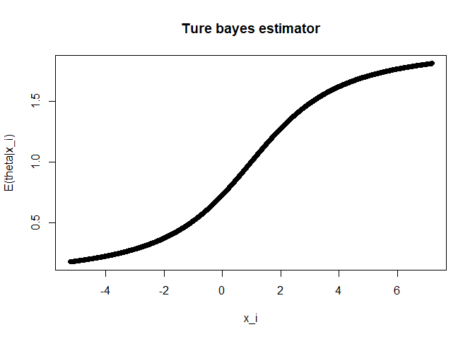<!-- -->

```r
# create a truncated estimator
x_est22 <- seq(1.64,max(y)+2,length.out=10000)
E_theta122 <- c()
for (i in 1:length(x_est22)) {
  E_theta122 <- c(E_theta122,bayes_est_parameter(theta,x_est22[i]))
}
data <- data.frame(theta=theta, y=y)
data$selected <- data$y>1.64
sub_data1 <- subset(data,data$selected==TRUE)
tau <- seq(from = 0, to = 2, by = 0.01)
result <- deconvo_trunc(a=1.64,b=Inf,tau,X=c(sub_data1$y),pDegree=6,n=60)
tprobs.hat <- result$stats[,'g']
f <- function(tau,y){sum(tau * tprobs.hat * dnorm(y,tau)/(1-pnorm(1.64-tau)),na.rm = TRUE)/sum(tprobs.hat * dnorm(y,tau)/(1-pnorm(1.64-tau)),na.rm = TRUE)
}
  E_theta_trunc1 <- c()
  for (i in 1:length(sub_data1$y)) {
  E_theta_trunc1 <- c(E_theta_trunc1,f(tau,sub_data1$y[i]))}

  # a for loop that calculate selective mle
  mu_hat <- c()
  mu_to_select <-seq(min(y),max(y),length.out=10000) 
  for (i in 1:length(sub_data1$y)) {
    mu_hat<-c(mu_hat,mu_to_select[which(dnorm(sub_data1$y[i]-mu_to_select)/(1-pnorm(1-mu_to_select))==max(dnorm(sub_data1$y[i]-mu_to_select)/(1-pnorm(1-mu_to_select))))] )
  }
```


```r
# plot the all the estimators of E(y|theta) with uniform prior
E_theta11 <- c()
for (i in 1:length(sub_data1$y)) {
  E_theta11 <- c(E_theta11,bayes_est_parameter(theta,sub_data1$y[i]))}

plot(y,theta,ylab="theta(unif)",xlab="zi",main= "Bayes Estimators for uniform prior")
points(sub_data1$y,E_theta11,col="orange")
lines(x_est1,E_theta1,col="red",lwd=2)
lines(y,y,col="purple",lwd=2)
lines(sort(sub_data1$y),sort(E_theta_trunc1),col="blue",lwd=2)
lines(sort(sub_data1$y),sort(mu_hat),col="green",lwd=2)
legend("bottomright",legend = c("Navie","True Bayes","Trunc Bayes","Selective MLE"),fill = c("purple","red","blue","green"))
```

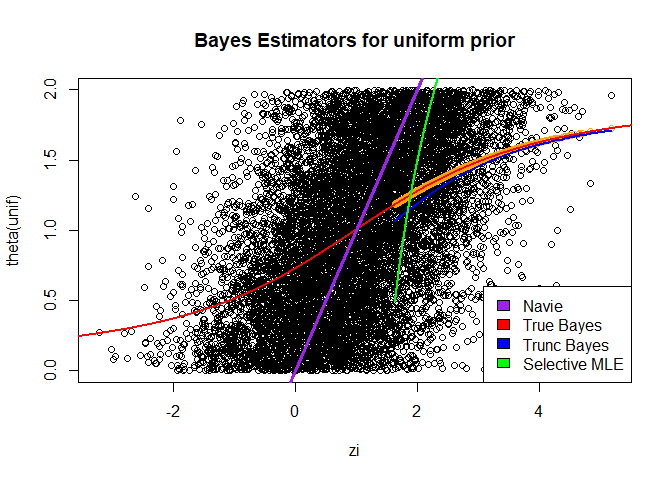<!-- -->


```r
# zoom in on y values that greater than 1.64
data <- data.frame(theta=theta, y=y)
data$selected <- data$y>1.64 # select the y values that greater than 1.64
sub_data <- subset(data,data$selected==TRUE)
plot(sub_data$y,sub_data$theta,ylab="theta(unif)",xlab="zi",main = paste0("zoom in on y>1.64 and number of obs is :",length(sub_data$y)))
lines(x_est1,E_theta1,col="red",lwd=2)
lines(y,y,col="purple",lwd=2)
lines(sort(sub_data1$y),sort(E_theta_trunc1),col="blue",lwd=2)
points(sub_data1$y,mu_hat,col="green",cex=0.5,pch=19)
legend("bottomright",legend = c("Navie","True Bayes","Trunc Bayes","Selective MLE"),fill = c("purple","red","blue","green"),cex=0.5)
```

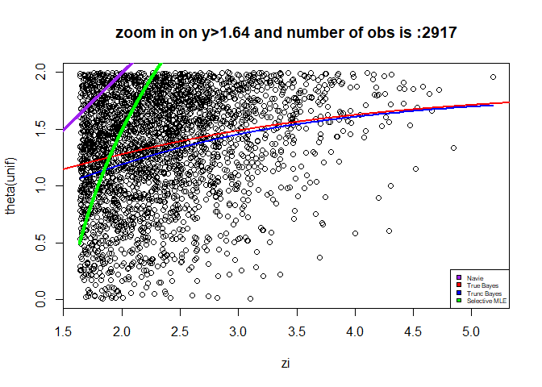<!-- -->


```r
# create another example of bayes estimation now theta ~N(1,1)
set.seed(23)
theta2 <- rnorm(10000,1,1) # theta is uniform
y2 <- rnorm(10000,theta2,1) # y is normal distribution with mu=theta
```


```r
# create oracle bayes estimator 
oracle_bay <-c()
x_est2 <- seq(min(y2),max(y2),length.out=10000)
#plot(x_est2,1/2+(x_est2/2))

for (i in 1:length(x_est2)) {
  oracle_bay <- c(oracle_bay,bayes_est_parameter(theta2,x_est2[i]))
}
```


```r
data21 <- data.frame(theta=theta2, y=y2)
data21$selected <- data21$y>1.64 # select y values greater than 1.64
sub_data21 <- subset(data21,data21$selected==TRUE)
# create truncated g modeling
tau2 <- seq(from = -4, to = 4, length.out=201)
result2 <- deconvo_trunc(a=1.64,b=Inf,tau2,X=sub_data21$y,pDegree=5,n=40)
tprobs.hat2 <- result2$stats[,'g']
f2 <- function(tau,y){sum(tau * tprobs.hat2 * dnorm(y,tau)/(1-pnorm(1.64-tau)),na.rm = TRUE)/sum(tprobs.hat2 * dnorm(y,tau)/(1-pnorm(1.64-tau)),na.rm = TRUE)
}
E_theta_trunc21 <- c()
for (i in 1:length(sub_data21$y)) {
E_theta_trunc21 <- c(E_theta_trunc21,f2(tau2,sub_data21$y[i]))}
  
  
# cerate selective mle estimator
mu_hat2 <- c()
mu_to_select2 <-seq(min(y2),max(y2),length.out=10000) 
for (i in 1:length(sub_data21$y)) {
mu_hat2<-c(mu_hat2,mu_to_select2[which(dnorm(sub_data21$y[i]-mu_to_select2)/(1-pnorm(1-mu_to_select2))==max(dnorm(sub_data21$y[i]-mu_to_select2)/(1-pnorm(1-mu_to_select2))))] )
  }
```


```r
plot(y2,theta2,ylab="theta(Normal)",xlab="y",main= "Bayes Estimators for Normal prior")
lines(x_est2,1/2+(x_est2/2),col="red",lwd=2)
lines(x_est2,oracle_bay,col="orange",lwd=2)
lines(y2,y2,col="purple",lwd=2)
lines(sort(sub_data21$y),sort(mu_hat2),col="green",lwd=2)
lines(sort(sub_data21$y),sort(E_theta_trunc21),col="blue",lwd=2)

legend("bottomright",legend = c("Navie","True Bayes","Trunc Bayes","Selective MLE","Bayes Estimator"),fill = c("purple","red","blue","green","orange"), cex=0.5)
```

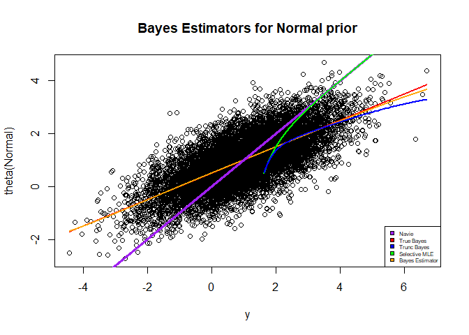<!-- -->


```r
# zoom in on y values greater than 1.64
data2 <- data.frame(theta=theta2, y=y2)
data2$selected <- data2$y>1.64
sub_data2 <- subset(data2,data2$selected==TRUE)
plot(sub_data2$y,sub_data2$theta,ylab="theta(Normal)",xlab="zi",main = paste0("zoom in on y>1.64 and number of obs is: ",length(sub_data2$y)),ylim=c(-2,6))
lines(x_est2,1/2+(x_est2/2),col="red",lwd=2)
lines(x_est2,oracle_bay,col="orange",lwd=2)
lines(y,y,col="purple",lwd=2)
lines(sort(sub_data21$y),sort(E_theta_trunc21),col="blue",lwd=2)

lines(sort(sub_data21$y),sort(mu_hat2),col="green",lwd=2)
legend("bottomright",legend = c("Navie","True Bayes","Trunc Bayes","Selective MLE","Bayes Estimator"),fill = c("purple","red","blue","green","orange"), cex=0.5)
```

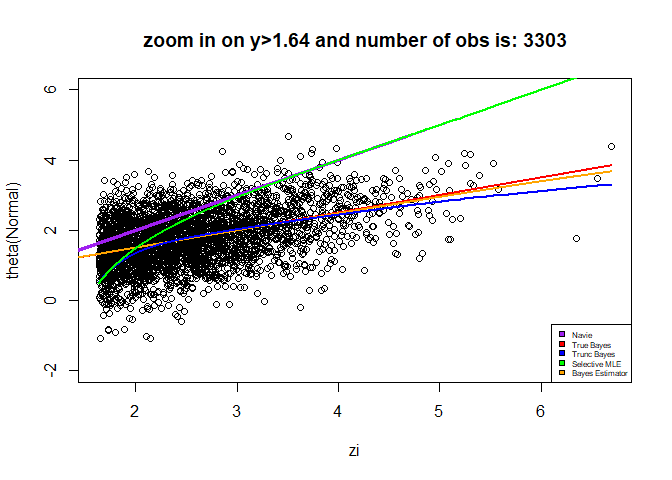<!-- -->


```r
# create another example of Bayes estimators , now theta N(0,0.1) with prob 0.85 and U(0,2) otherwise
theta3<-c()
for (i in 1:10000) {
  toss<-runif(1,0,1)
  if (toss<=0.85) {
    theta3 <-c(theta3,rnorm(1,mean = 0,sd=0.1))
  }else{
    theta3 <-c(theta3,runif(1,0,2))
  }
}
y3 <- rnorm(10000,mean=theta3,sd=1)
```


```r
x_est3 <- seq(min(y3),max(y3),length.out=10000)
oracle_bay3 <-c()
for (i in 1:length(x_est3)) {
  oracle_bay3 <- c(oracle_bay3,bayes_est_parameter(theta3,x_est3[i]))
}
```


```r
data31 <- data.frame(theta=theta3, y=y3)
data31$selected <- data31$y>1.64
sub_data31 <- subset(data31,data31$selected==TRUE)
tau3 <- seq(-1,2,length.out=30)
result3 <- deconvo_trunc(a=1,b=Inf,tau3,X=sub_data31$y,pDegree=15,n=100,c0=0.1)
tprobs.hat3 <- result3$stats[,'g']
f3 <- function(tau,y){sum(tau * tprobs.hat3 * dnorm(y,tau)/(1-pnorm(1.64-tau)),na.rm = TRUE)/sum(tprobs.hat3 * dnorm(y,tau)/(1-pnorm(1.64-tau)),na.rm = TRUE)}

 E_theta_trunc3 <- c()
  for (i in 1:length(sub_data31$y)) {
  E_theta_trunc3 <- c(E_theta_trunc3,f3(tau3,sub_data31$y[i]))}
 
 E_theta_trunc4 <- c()
  for (i in 1:length(sub_data31$y)) {
  E_theta_trunc4 <-c(E_theta_trunc4,bayes_est_parameter(theta3,sub_data31$y[i]))}
 

  
plot(y3,theta3,ylab="theta(Mixture)",xlab="y",main= paste0("Bayes Estimators for Mixture prior y>1.64 and obs:",length(sub_data31$y)))
points(sub_data31$y,E_theta_trunc4,col="orange",lwd=2)
lines(x_est3,oracle_bay3,col="red",lwd=2)
lines(sort(sub_data31$y),sort(E_theta_trunc3),col="blue",lwd=2)
```

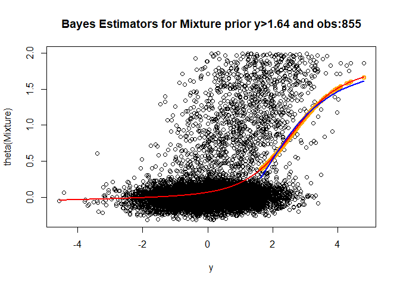<!-- -->


```r
# Exponential example with tweedie method estimator
j<- 1:500
muj <- -log((j-0.5)/500)
muj <- rep(muj,10)
exp_example <- rnorm(5000,muj,1)
counts<-hist(exp_example,breaks = 50,plot=F)

to_model <- hist(exp_example,breaks = 63,plot = F)
  y_to_model <- to_model$counts
  X_to_model <- to_model$mids
  f <- glm(y_to_model ~ ns(X_to_model,df = 5), family=poisson)$fit
  plot(X_to_model,log(y_to_model),main="Lindseys method",ylab="log(count)",xlab="z value")
  lines(X_to_model,log(f),col="green")
  legend("topleft",legend = "fitted values of l(z)",fill = "green")
```

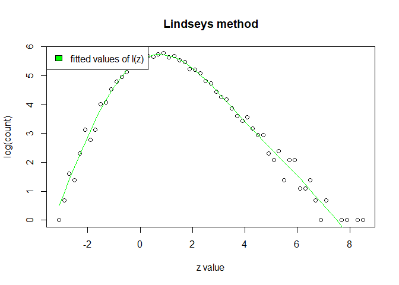<!-- -->

```r
  lz <- as.vector(log(f))
  lz.=diff(lz)/diff(X_to_model)
  new_centers <- (X_to_model[-1]+X_to_model[-length(X_to_model)])/2
  
  # g-model
  t <- seq(min(exp_example),max(exp_example),length.out=20)
  res <- deconv(tau = t,X = exp_example,family = "Normal",pDegree = 7,n=20,c0 =1)
```

```
## Warning in stats::nlm(f = loglik, p = aStart, gradtol = 1e-10, ...): NA/Inf
## replaced by maximum positive value
```

```r
g <- res$stats[,"g"]
pij <- res$P
E_tau <- c()
for (i in 1:dim(pij)[1]) {
    E_tau  <- c(E_tau,sum(t*pij[i,]*g)/pij[i,]%*%g)
}
t_tau <- (t[-1]+t[-length(t)])/2  

#truncated g-modeling
  
alp <- quantile(exp_example,0.95)
select4 <- exp_example[exp_example>alp]
tau4 <- seq(-2.8,length.out=30)
result4 <- deconvo_trunc(a=alp,b=Inf,tau4,X=select4,pDegree=7,n=30,c0=1)
tprobs.hat4 <- result4$stats[,'g']
f4 <- function(tau,y){sum(tau * tprobs.hat4 * dnorm(y,tau)/(1-pnorm(alp-tau)),na.rm = TRUE)/sum(tprobs.hat4 * dnorm(y,tau)/(1-pnorm(alp-tau)),na.rm = TRUE)}
E_theta_trunc5 <- c()
  for (i in 1:length(select4)) {
  E_theta_trunc5 <- c(E_theta_trunc5,f4(tau4,select4[i]))}

x_est3 <- seq(min(exp_example),max(exp_example),length.out=50)
oracle_bay3 <-c()
for (i in 1:length(x_est3)) {
  oracle_bay3 <- c(oracle_bay3,bayes_est_parameter(muj,x_est3[i]))}
  
  plot(exp_example,muj,main="Exponential example",ylab="E(theta|X)",xlab="z value")
  lines(sort(y),sort(y+approx(new_centers,lz.,y,rule=2,ties=mean)$y),type = "l",col="purple",lwd=3)
  lines(sort(t_tau),sort(E_tau),col="red",lwd=3,lty="dashed")
  lines(sort(select4),sort(E_theta_trunc5),col="blue",lwd=3)
  points(x_est3,oracle_bay3,col="green")
  legend("topleft",legend =c("Tweedie","g-modeling","Trunc-modeling","True bayes"),fill = c("purple","red","blue","green"))
```

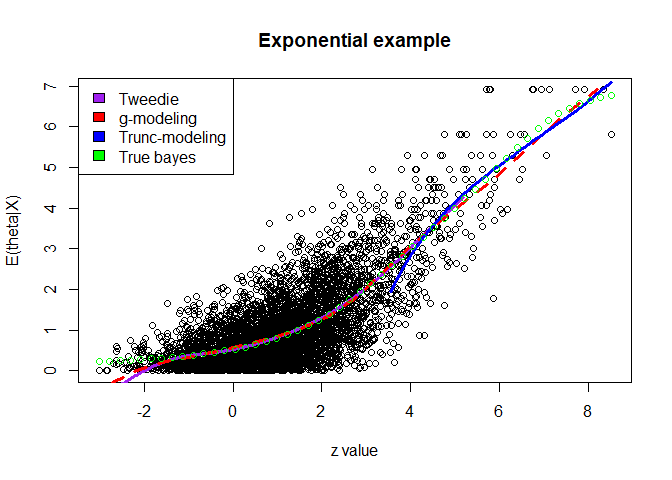<!-- -->


### section 4 plots:Representation of the solution for the Truncated case:

#### $\\tilde{g}$ SE simulation


```r
# a function that simulate SE of g tilde
SE_simolation <- function(n_sim,c,n,rt) {
  # create data frames for output
  g_simu_data <- data.frame()
  g_tilde_simu_data <- data.frame()
  sum_g_simu_data <-c()
  gs_simu_data <- data.frame()
  gs_sd_simu_data <-data.frame()
  for (i in 1:n_sim) {
    # sample data for the simulation
    g_theta <- rnorm(n,mean=0,sd=1)
    X_theta <- rnorm(n,mean=g_theta,sd=1)
    data_sim <- data.frame(theta=g_theta, X_theta=X_theta)
    data_sim$selected <- data_sim$X_theta>c
    sub_data_sim<- subset(data_sim,data_sim$selected==TRUE)
    g_theta_trunck <- sub_data_sim$theta
    

    range_tau <- seq(-7,7,by=0.1)
    # calculate g-modeling
    g_hat<-deconv(tau = range_tau,X =X_theta,n=length(X_theta)+1,family = "Normal",pDegree = 4)
    P_t <- deconvo_trunc_comp(a=c,b=Inf,tau=range_tau,X=X_theta[X_theta>c],n = length(sub_data_sim$X_theta),pDegree = 4,c0 = 2)
    g_hat <- g_hat$stats[,"g"]
    # calcualte truncated g-modeling
    g_hat_s <- deconvo_trunc(a=c,b=Inf,tau=range_tau,X=X_theta[X_theta>c],n = length(sub_data_sim$X_theta),pDegree = 4,c0 = 2)
    # extract functions sd
    gs_sd_simu_data <- rbind(gs_sd_simu_data,g_hat_s$stats[,"SE.g"])
    g_hat_s <- g_hat_s$stats[,"g"]
    
    
    g_hat_s_c <-g_hat_s[range_tau>=rt]/colSums(P_t[,range_tau>=rt])
    small_tau_range <-range_tau[range_tau>=rt]
    gs_simu_data <- rbind(gs_simu_data,g_hat_s)
    g_simu_data <- rbind(g_simu_data,g_hat)
    sum_g_simu_data <-c(sum_g_simu_data,sum(g_hat_s_c))
    g_tilde_simu_data <- rbind(g_tilde_simu_data,g_hat_s_c/sum(g_hat_s_c))
    
  }
  return(list(g=g_simu_data,sum_g=sum_g_simu_data,g_tilde=g_tilde_simu_data,gs=gs_simu_data,gs_sd=gs_sd_simu_data))
}

ressi<-SE_simolation(n_sim=100,c=1,n=10000,rt=-2)
```


```r
# a simulation for SE of g tilde now calculated by the formula 
SE_simulation_Theo<-function(n_sim,c,n=10000,rt,flag_rt=T){
  g_tilde_sd_simu <- data.frame()
  for (i in 1:n_sim) {
  g_theta <- rnorm(n,mean=0,sd=1)
  X_theta <- rnorm(n,mean=g_theta,sd=1)
  data_sim <- data.frame(theta=g_theta, X_theta=X_theta)
  data_sim$selected <- data_sim$X_theta>c
  sub_data_sim<- subset(data_sim,data_sim$selected==TRUE)
  g_theta_trunck <- sub_data_sim$theta
  if (flag_rt==T) {
    min_val<-rt
  }else{
    min_val<-min(g_theta_trunck)
  }
  

  range_tau <- seq(-7,7,by=0.1)
  g_hat<-deconv(tau = range_tau,X=X_theta,n=length(X_theta),family = "Normal",pDegree = 4)
  P_t <- deconvo_trunc_comp(a=c,b=Inf,tau=range_tau,X=X_theta[X_theta>c],n = length(sub_data_sim$X_theta),pDegree = 4)
  g_hat_se <-g_hat$stats[,"SE.g"]
  g_hat <- g_hat$stats[,"g"]
  g_hat_s <- deconvo_trunc(a=c,b=Inf,tau=range_tau,X=X_theta[X_theta>c],n = length(sub_data_sim$X_theta),pDegree = 4)
  a <- g_hat_s$mle
  Q <- g_hat_s$Q
  P <- g_hat_s$P
  g_hat_s <- g_hat_s$stats[,"g"]
  N<-length(X_theta[X_theta>c])


g_til <-(g_hat_s[range_tau>=min_val]/colSums(P_t[,range_tau>=min_val]))/(sum(g_hat_s[range_tau>=min_val]/colSums(P_t[,range_tau>=min_val])))
D_at <-diag(g_til) - g_til%*%t(g_til)
C <- colSums(P_t[,range_tau>=min_val])
D_a <- diag(g_hat_s) - g_hat_s%*%t(g_hat_s)
I <- N*t(Q)%*%D_a%*%t(P)%*%solve(diag(as.vector(P%*%g_hat_s)))%*%P%*%D_a%*%Q
s_dots <-(1/norm(a,"2"))*(diag(x=1,length(a),length(a))-(a%*%t(a)/(norm(a,"2"))^2)) 
cov_a <- solve(I+s_dots)%*%I%*%solve(I+s_dots)
my_se_t <- D_at%*%Q[range_tau>=min_val,]%*%cov_a%*%t(Q[range_tau>=min_val,])%*%D_at
g_tilde_sd_simu <-  rbind(g_tilde_sd_simu,sqrt(diag(my_se_t)))
  }
if (flag_rt==F) {
  return(list(g_tilde_sd_simu,min(g_theta_trunck),g_hat_se,g_til,g_hat_s,g_hat))  
}else{
  return(list(g_tilde_sd_simu,g_hat_se,g_til,g_hat_s,g_hat))
}  
  
}

theo_simo_data <-SE_simulation_Theo(n_sim=1,c=1,n=10000,rt=-2)
c_star=-4
# a function that create SE outputs
calc_diff <-function(c_star){
  SE<-SE_simulation_Theo(n_sim=1,c=c_star,n=10000,rt=-2,flag_rt=F)
  g_tilde <-as.vector(unlist(SE[4]))
  g_hat_s <-as.vector(unlist(SE[5]))
  g_hat <-as.vector(unlist(SE[6]))
  SE_g <-as.vector(unlist(SE[3]))
  SE_g_tilde <-as.vector(unlist(SE[1]))
  val1 <-abs(SE_g_tilde-SE_g[range_tau>=unlist(SE[2])])
  val2 <-max(val1)/SE_g[which(val1==max(val1))]
  val3 <-max(val1)/SE_g_tilde[which(val1==max(val1))]
  val4 <- mean((g_tilde-g_hat[range_tau>=unlist(SE[2])])^2)
  val5 <- mean((g_hat_s[range_tau>=unlist(SE[2])]-g_hat[range_tau>=unlist(SE[2])])^2)
  return(list(max(val1),val2,val3,val4,val5))}
```


```r
gs_sd <-apply(ressi$gs_sd,2,mean)
n<-10000
c <- 1
g_theta <- rnorm(n,mean=0,sd=1)
X_theta <- rnorm(n,mean=g_theta,sd=1)
data_sim <- data.frame(theta=g_theta, X_theta=X_theta)
data_sim$selected <- data_sim$X_theta>c
sub_data_sim<- subset(data_sim,data_sim$selected==TRUE)
g_theta_trunck <- sub_data_sim$theta
    

range_tau <- seq(-7,7,by=0.1)
g_hat<-deconv(tau = range_tau,X =X_theta,n=length(X_theta)+1,family = "Normal",pDegree = 4)
P_t <- deconvo_trunc_comp(a=c,b=Inf,tau=range_tau,X=X_theta[X_theta>c],n = length(sub_data_sim$X_theta),pDegree = 4,c0 = 2)
g_hat_s <- deconvo_trunc(a=c,b=Inf,tau=range_tau,X=X_theta[X_theta>c],n = length(sub_data_sim$X_theta),pDegree = 4,c0 = 2)

N<-length(X_theta[X_theta>c])    
a <- g_hat_s$mle
Q <- g_hat_s$Q
P <- g_hat_s$P

D_a <- diag(g_hat_s$stats[,"g"]) - g_hat_s$stats[,"g"]%*%t(g_hat_s$stats[,"g"])
I <- N*t(Q)%*%D_a%*%t(P)%*%solve(diag(as.vector(P%*%g_hat_s$stats[,"g"])))%*%P%*%D_a%*%Q
s_dots <-(1/norm(a,"2"))*(diag(x=1,length(a),length(a))-(a%*%t(a)/(norm(a,"2"))^2)) 
cov_a <- solve(I+s_dots)%*%I%*%solve(I+s_dots)
my_se <- D_a%*%Q%*%cov_a%*%t(Q)%*%D_a


SE_gg2 <- data.frame(cbind(g_hat_s$stats[,"theta"]),g_hat_s$stats[,"SE.g"],sqrt(diag(my_se)),gs_sd)
colnames(SE_gg2)<- c("Theta","function_res","Theo_res","simulation_sd")

ggplot(SE_gg2)+geom_line(aes(x=Theta,y=Theo_res,color="Theoratical SE")) + geom_point(aes(x=Theta,y=simulation_sd,color="Simulation SE"))+ ylab("SE")+xlab(TeX("\\theta"))+ theme_classic() +theme(legend.position = "bottom", legend.title = element_blank())
```

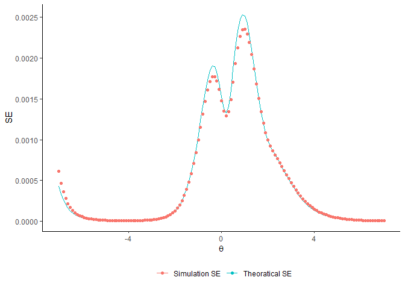<!-- -->


```r
n<-20000
c <- 1
g_theta <- rnorm(n,mean=0,sd=1)
X_theta <- rnorm(n,mean=g_theta,sd=1)
data_sim <- data.frame(theta=g_theta, X_theta=X_theta)
data_sim$selected <- data_sim$X_theta>c
sub_data_sim<- subset(data_sim,data_sim$selected==TRUE)
g_theta_trunck <- sub_data_sim$theta

bx<-ggplot(data_sim,aes(x=X_theta))+geom_histogram(aes(y=..density..),col="black",fill="white")+ggtitle(TeX("histogram of f(X)"))+xlab(TeX("X")) +geom_vline(xintercept =mean(X_theta),color = "blue", size=1) +geom_text(aes(x=2, label=paste("mean= ",round(mean(X_theta)),3), y=0.4), colour="blue") + geom_density(linewidth=1.2,linetype = 2,colour = 2)+ theme_classic()
```

```
## Warning: Using `size` aesthetic for lines was deprecated in ggplot2 3.4.0.
## ℹ Please use `linewidth` instead.
```

```r
bxt <-ggplot(sub_data_sim,aes(x=X_theta))+geom_histogram(aes(y=..density..),col="black",fill="white")+ggtitle(TeX("histogram of f(X>c|\\theta) with c=1"))+xlab(TeX("X")) +geom_vline(xintercept =mean(X_theta[X_theta>c]),color = "blue", size=1) +geom_text(aes(x=2.5, label=paste("mean= ",round(mean(X_theta[X_theta>c]),3)), y=0.6), colour="blue") + geom_density(linewidth=1.2,linetype = 2,colour = 2) + ylab("")+ theme_classic()

bg<-ggplot(data_sim,aes(x=theta))+geom_histogram(aes(y=..density..),col="black",fill="white")+ggtitle(TeX("histogram of g(\\theta)"))+xlab(TeX("\\theta")) +geom_vline(xintercept =mean(g_theta),color = "blue", size=1) +geom_text(aes(x=2, label=paste("mean= ",round(mean(g_theta)),3), y=0.4), colour="blue") + geom_line(aes(x=theta,y=dnorm(g_theta)),linewidth=1.2,linetype = 2,colour = 2)+ theme_classic()

bgt <-ggplot(sub_data_sim,aes(x=theta))+geom_histogram(aes(y=..density..),col="black",fill="white")+ggtitle(TeX("histogram of g(\\theta|X>c) with c=1"))+xlab(TeX("\\theta"))+geom_density(linewidth=1.2,linetype = 2,
               colour = 2) +ylab("") +geom_vline(xintercept =mean(g_theta_trunck),color = "blue", size=1) +geom_text(aes(x=2, label=paste("mean= ",round(mean(g_theta_trunck),3)), y=0.55), colour="blue")+ theme_classic()

ggarrange(bx,bxt,bg,bgt)
```

```
## Warning: The dot-dot notation (`..density..`) was deprecated in ggplot2 3.4.0.
## ℹ Please use `after_stat(density)` instead.
```

```
## `stat_bin()` using `bins = 30`. Pick better value with `binwidth`.
## `stat_bin()` using `bins = 30`. Pick better value with `binwidth`.
## `stat_bin()` using `bins = 30`. Pick better value with `binwidth`.
## `stat_bin()` using `bins = 30`. Pick better value with `binwidth`.
```

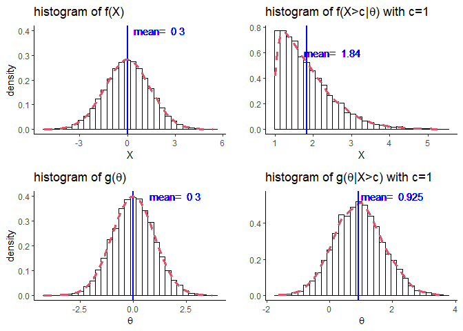<!-- -->


in the figure, we can observe that applying the correction to the truncated estimator results in an approximation of
estimator that based of the complete data set, $g(θ_i; ˆα)$. Therefore, we can calculate some probabilities that are related
directly to $g(θ)$


```r
# G-modeling with and without correction plot
range_tau <- seq(-7,7,by=0.1)
g_hat<-deconv(tau = range_tau,X =X_theta,n=length(X_theta)+1,family = "Normal",pDegree = 4)
P_t <- deconvo_trunc_comp(a=c,b=Inf,tau=range_tau,X=X_theta[X_theta>c],n = length(sub_data_sim$X_theta),pDegree = 4,c0 = 2)
g_hat <- g_hat$stats[,"g"]
g_hat_s <- deconvo_trunc(a=c,b=Inf,tau=range_tau,X=X_theta[X_theta>c],n = length(sub_data_sim$X_theta),pDegree = 4,c0 = 2)

a <- g_hat_s$mle
Q <- g_hat_s$Q
P <- g_hat_s$P

g_hat_s <- g_hat_s$stats[,"g"]


gedf <- data.frame(tau= range_tau,gh=g_hat,gsh=g_hat_s)

g_hat_s_c <-g_hat_s[range_tau>-2]/colSums(P_t[,range_tau>-2])
small_tau_range <-range_tau[range_tau>-2]

gedf2 <-data.frame(tau=range_tau[range_tau>-2],gsch=g_hat_s_c/sum(g_hat_s_c))

#gedf3 <-data.frame(tau=range_tau[range_tau>-2],gsch=(g_hat_s[range_tau>-2]/(1-pnorm(q = #1,mean=range_tau[range_tau>-2])))/sum(g_hat_s[range_tau>-2]/(1-pnorm(q = #1,mean=range_tau[range_tau>-2]))))

pgedf<- ggplot() +geom_line(data=gedf,aes(x=tau,y=gh,color="g hat"),linewidth=1.2,linetype = 2) +geom_line(data=gedf,aes(x=tau,y=gsh,color="gs hat"),linewidth=1.2,linetype = 2) + ylim(c(0,0.06)) + ggtitle("G-modeling with and without correction")+xlab(TeX("\\theta"))+ylab(TeX("g(\\theta)"))+geom_line(data = gedf2,aes(x=tau,y=gsch,color="gs hat after correction"),linewidth=1.2,linetype = 2)

pgedf + theme_classic() +theme(legend.position = "bottom", legend.title = element_blank())
```

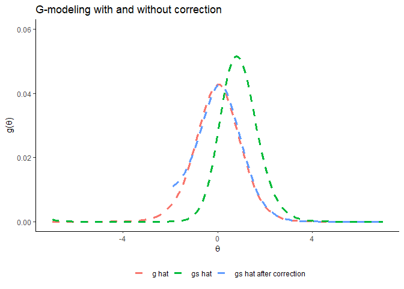<!-- -->

```r
# Simulation SE vs Theoratical SE of g plot
ressi<-SE_simolation(n_sim=20,c=1,n=10000,rt=-2.5)
theo_simo_data <-SE_simulation_Theo(n_sim=1,c=1,n=10000,rt=-2.5)
c1 <- apply(ressi$g_tilde,2,sd)
c2 <-colMeans(data.frame(theo_simo_data[1]))
plot_df <- data.frame(cbind(range_tau[range_tau>=-2.5],c2,c1))
colnames(plot_df)<-c("Theta","theo_g_tilde","simo_g_tilde")
ggplot(plot_df)+geom_line(aes(x=Theta,y=theo_g_tilde,color="Theoratical SE")) + geom_point(aes(x=Theta,y=simo_g_tilde,color="Simulation SE"))+ggtitle(TeX("Simulation SE vs Theoratical SE of \\tilde{g}(\\alpha;\\theta)")) + ylab("SE")+xlab(TeX("\\theta"))+theme_bw() +theme(legend.position = "bottom", legend.title = element_blank())
```

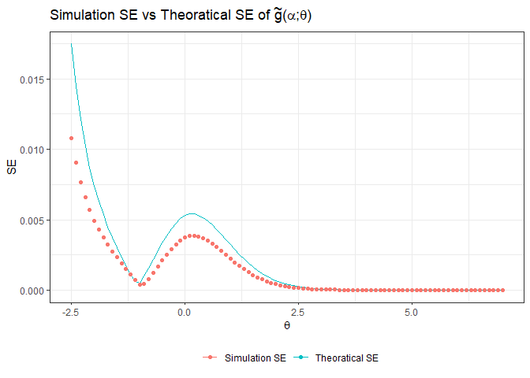<!-- -->


```r
# comparison between truncated g-modeling and g modeling and a comparison between f-modeling and truncated F-modeling
load("prostatedata.RData")
load("prostz.RData") # load "prostatedata
ggplot(data =data.frame(prostz) ) +geom_histogram(aes(prostz),bins = 30,col="black",fill="white") + ggtitle("Histogram prostz data") +theme_bw()
```

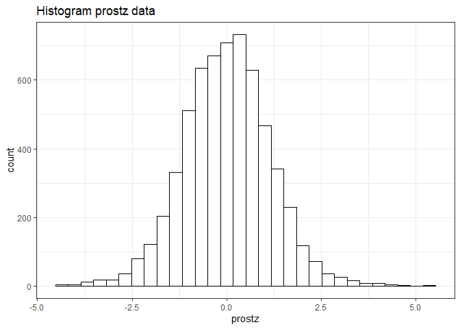<!-- -->

```r
# truncated g-modeling

alp <- quantile(prostz,0.95) # select that 0.95 percentile of the data
select4 <- prostz[prostz>alp]
tau4 <- seq(-1,5.5,length.out=60)
result4 <- deconvo_trunc(a=alp,b=Inf,tau4,X=select4,pDegree=7,n=60,c0=1)
tprobs.hat4 <- result4$stats[,'g']
f4 <- function(tau,y,g){sum(tau * g * dnorm(y,tau)/(1-pnorm(alp-tau)),na.rm = TRUE)/sum(g * dnorm(y,tau)/(1-pnorm(alp-tau)),na.rm = TRUE)}
E_theta_trunc5 <- c()
  for (i in 1:length(select4)) {
  E_theta_trunc5 <- c(E_theta_trunc5,f4(tau4,select4[i],tprobs.hat4))}

# g-model
t <- seq(min(prostz),max(prostz),length.out=60)
res <- deconv(tau = t,X = prostz,family = "Normal",pDegree = 7,n=60,c0 =1)
g <- res$stats[,"g"]
pij <- res$P
E_tau <- c()
for (i in 1:dim(pij)[1]) {
    E_tau  <- c(E_tau,sum(t*pij[i,]*g)/pij[i,]%*%g)
}

# F-modeling and truncated F-modeling
t_tau <- (t[-1]+t[-length(t)])/2
t_prostz <- (prostz[-1]+prostz[-length(prostz)])/2
l_tag<-lindseys_method(prostz,bins = 60,deg=6)
l_tag2<-lindseys_method(select4,bins = 60,deg=4)

plot(sort(prostz),sort(prostz+(1.06^2)*l_tag),type = "l",lwd=2,ylab="E(theta|X)",xlab = "z value",col="purple",main="Prostate Data Estimation")
lines(sort(select4),sort(E_theta_trunc5),col="blue",lwd=2)
lines(sort(t_tau),sort(E_tau),col="red",lwd=2,lty="dashed")
lines(sort(select4),sort(select4+(1.06^2)*(l_tag2)),col="green")
legend("topleft",legend =c("Tweedie","g-modeling","trunc-modeling"),fill = c("purple","red","blue"))
```

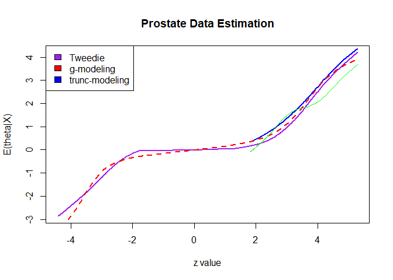<!-- -->

```r
df_tweede <-data.frame(cbind(sort(prostz),sort(prostz+(1.06^2)*l_tag)))
df_tweede_s <-data.frame(cbind(sort(select4),sort(select4+(1.06^2)*(l_tag2))))
colnames(df_tweede)<-c("prostz","f-modeling")
colnames(df_tweede_s)<-c("prostz_s","fs-modeling")
df_G <-data.frame(cbind(sort(t_tau),sort(E_tau)))
df_Gs <-data.frame(cbind(sort(select4),sort(E_theta_trunc5)))
colnames(df_G)<-c("prostz","G-modeling")
colnames(df_Gs)<-c("prostz_s","Gs-modeling")
gg1<-ggplot()+geom_line(data =df_tweede,aes(prostz,`f-modeling`),linewidth=1.2,linetype = 2)+geom_line(data =df_tweede_s,aes(prostz_s,`fs-modeling`),linewidth=1.2,linetype = 1)+ylab(TeX("E(\\theta|z)"))+ggtitle("f-modeling vs truncated f-modeling")+xlab("z-value")+theme_bw()
gg2<-ggplot()+geom_line(data =df_G,aes(prostz,`G-modeling`),linewidth=1.2,linetype = 2)+geom_line(data =df_Gs,aes(prostz_s,`Gs-modeling`),linewidth=1.2,linetype = 1)+ggtitle("g-modeling vs truncated g-modeling")+ylab("")+xlab("z-value")+theme_bw()
ggarrange(gg1,gg2)
```

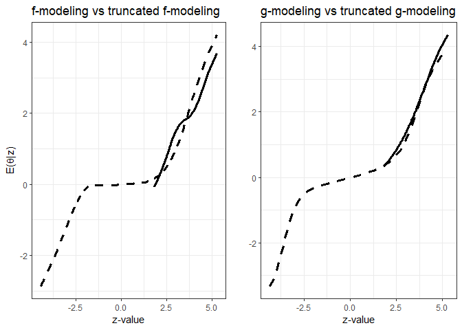<!-- -->

